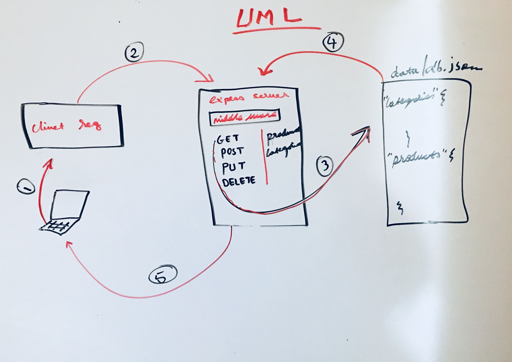

## LAB - Class 07

* Author: Eyob Tamir

### Links and Resources
submission PR

### back-end server url (when applicable)
* http//:localhosts:3000  - for home page *
* http//:localhosts:3000/products  - for products page * 
* http//:localhosts:3000/categories  - for categoris page *

### Heroku Link
* https://lab-07-express-swagger.herokuapp.com/ *

### Swagger Link
* https://lab-07-express-swagger.herokuapp.com/api-docs *

### Setup
* .env requirements (where applicable)
i.e.

### PORT - Port Number
    PORT-3000

### How to initialize/run your application 
e.g. `npm start`, `nodemon`
How to use your library (where applicable)
### Tests
* jest --verbose --coverage

UML
